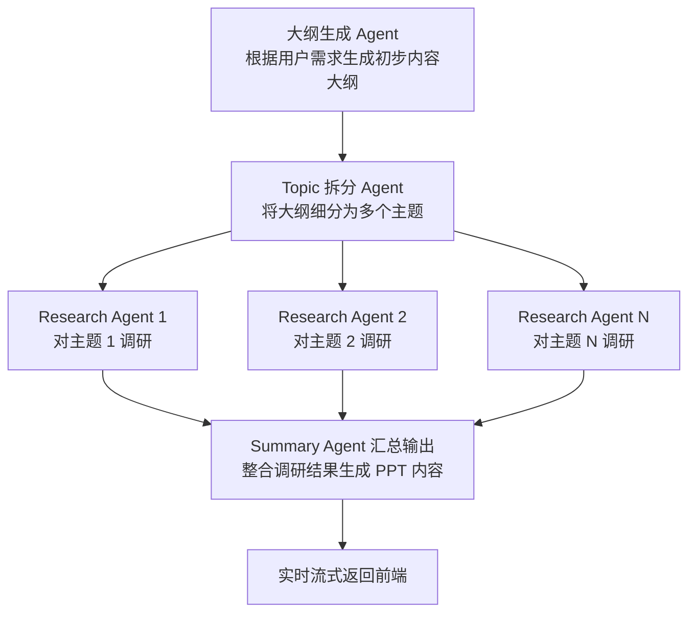

# 🧠 TrainPPTAgent 自动生成 PPT 内容

本项目基于多智能体（Multi-Agent）协作架构，实现从内容大纲出发，自动完成主题拆解、信息调研与汇总生成 PPT 内容的流程。

---

## 🔧 核心功能模块

| Agent 名称                | 功能描述                   |
|-------------------------|------------------------|
| `split_outline_agent`   | 将输入的大纲内容拆解为每页的ppt要写的内容 |
| `ppt_generator_loop_agent`  | 为每页ppt的大纲生成ppt的内容      |

---

## 🚀 快速开始

---

### 1. 修改 Agent 使用的模型

编辑模型配置文件以自定义每个 Agent 所调用的模型（如 GPT-4、Claude、Gemini 等）：

```python
# 配置模型的路径
backend/slide_agent/slide_agent/config.py
```

---

### 2. 启动本地测试

直接启动 Agent API 服务进行测试：

```bash
python main_api.py
```

---

### 3. 启动后端 API 服务（供前端调用）

提供标准 API 接口（支持 SSE 流式返回），供前端请求：

```bash
python main_api.py
```

## 注意需要修改tools.py中的搜索引擎
slide_agent/sub_agents/ppt_writer/tools.py

---

## 📁 项目结构简要说明

```text
.
├── README.md                    # 使用说明文档
├── __init__.py                 # 包初始化文件
├── a2a_client.py               # 示例客户端，用于测试向 Agent 发送请求
├── adk_agent_executor.py       # 基于 ADK 的 Agent 调度执行器
├── env_template                # 环境变量模板文件（用于创建 .env）
├── main_api.py                 # 提供 HTTP/SSE API 的主程序（供前端调用）
├── pyproject.toml              # Python 项目配置文件（依赖与构建）
└── slide_agent/                # 多 Agent 核心逻辑目录
    ├── __init__.py
    ├── agent.py                # 核心 Agent 管理逻辑（注册与调度）
    ├── agent_utils.py          # Agent 辅助工具函数（如日志、格式转换等）
    ├── config.py               # Agent 配置文件（模型参数、Agent 路由等）
    ├── create_model.py         # 创建和初始化模型实例
    ├── utils.py                # 通用工具函数
    └── sub_agents/             # 各子任务的智能体模块
        ├── __init__.py
        └── ppt_writer/         # PPT 内容生成 Agent：拆解大纲并逐页撰写
            ├── agent.py        # PPT Writer Agent 主体
            ├── prompt.py       # Agent 使用的提示词模板
            ├── tools.py        # 调研用工具函数（如搜索、摘要等）
            ├── utils.py        # 辅助工具函数
            ├── cache_utils.py  # 缓存相关工具
            └── weixin_search.py # 微信搜索实现
```


## 📊 并发的多Agent的协作流程


## a2a_client.py 客户端测试
输出结果:
```
/Users/admin/miniforge3/envs/multiagent/bin/python3.12 /Users/admin/git/MultiAgentPPT/backend/slide_agent/a2a_client.py 

```

## 注意：
main_api.py服务器部署时的agent_url，是对外提供服务的url，有时可能和监听地址不同，尤其是内外网环境时。

